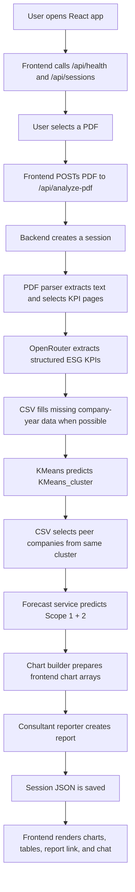

# ESG PDF Intelligence: Full Code And Flow Walkthrough

This guide explains the project in the order the system actually runs.

Use it like a learning path:

1. Understand the whole data flow.
2. Learn the backend files in execution order.
3. Learn the frontend files in execution order.
4. Connect every file back to the same upload-to-report pipeline.

---

## 1. One-Line Concept

The app takes an ESG/BRSR PDF, extracts ESG KPIs, assigns a KMeans cluster, compares the company with cluster peers from CSV, forecasts emissions, and displays everything in a React dashboard with a consultant chatbot.

---

## 2. Complete Runtime Flow



Core rule:

```text
KMeans_cluster is the real peer grouping key.
peer_group exists only as a backward-compatible alias.
```

---

## 3. External Model And CSV Files

These files live outside the repo and are read from paths in `backend/.env`.

### Model Files

```text
preprocessor.pkl
kmeans_model.pkl
pca.pkl
lstm_model.keras
lstm_scaler.pkl
```

Purpose:

- `preprocessor.pkl`: transforms raw clustering inputs into model-ready numeric vectors.
- `pca.pkl`: reduces the transformed clustering features.
- `kmeans_model.pkl`: predicts `KMeans_cluster`.
- `lstm_model.keras`: forecasts emissions.
- `lstm_scaler.pkl`: scales KPI inputs before forecasting.

### CSV Files

```text
cluster_summary.csv
peer_groups.csv
cluster_forecast.csv
```

Purpose:

- `cluster_summary.csv`: maps cluster id to readable cluster label.
- `peer_groups.csv`: maps cluster id to sample peer company names.
- `cluster_forecast.csv`: acts like the temporary database for company-year KPI rows, peer averages, and peer forecasts.

---

# Backend Learning Flow

Start with backend because it owns the real analysis.

---

## 4. `backend/run_backend_local.py`

File:

```text
backend/run_backend_local.py
```

Why it exists:

Your local `.venv` launcher points to a missing Windows Store Python, so this runner manually adds the backend and venv package folders to `sys.path`, then starts Uvicorn.

### Block 1: Imports And Paths

```python
from __future__ import annotations

import sys
from pathlib import Path

ROOT = Path(__file__).resolve().parent
SITE_PACKAGES = ROOT / ".venv" / "Lib" / "site-packages"
LOG_PATH = ROOT / "runtime" / "backend-local.log"
```

Functionality:

- Finds the backend folder.
- Finds the installed Python packages inside `.venv`.
- Chooses a log file.

Example:

```text
ROOT = C:\...\backend
SITE_PACKAGES = C:\...\backend\.venv\Lib\site-packages
```

### Block 2: Add Import Paths

```python
sys.path.insert(0, str(ROOT))
sys.path.insert(0, str(SITE_PACKAGES))
```

Functionality:

- Lets Python import `app.main`.
- Lets Python import FastAPI, pandas, sklearn, TensorFlow from the venv package folder.

### Block 3: Start Server

```python
import uvicorn

if __name__ == "__main__":
    LOG_PATH.parent.mkdir(parents=True, exist_ok=True)
    log_file = LOG_PATH.open("a", encoding="utf-8", buffering=1)
    sys.stdout = log_file
    sys.stderr = log_file
    uvicorn.run("app.main:app", host="127.0.0.1", port=8000)
```

Functionality:

- Sends backend logs to `runtime/backend-local.log`.
- Runs FastAPI at `http://127.0.0.1:8000`.

How to run:

```powershell
cd backend
& "C:\Program Files\PostgreSQL\15\pgAdmin 4\python\python.exe" run_backend_local.py
```

---

## 5. `backend/app/main.py`

File:

```text
backend/app/main.py
```

This is the FastAPI app factory.

### Block 1: Imports

```python
from fastapi import FastAPI
from fastapi.middleware.cors import CORSMiddleware

from app.api.routes import router
from app.config import get_settings
```

Functionality:

- Imports FastAPI.
- Imports CORS support so React can call the backend.
- Imports all API routes.
- Imports settings from `.env`.

### Block 2: `create_app`

```python
def create_app() -> FastAPI:
    settings = get_settings()
    app = FastAPI(title="ESG PDF Intelligence API", version="0.1.0")
```

Functionality:

- Builds the app object.
- Loads settings once.

### Block 3: CORS

```python
app.add_middleware(
    CORSMiddleware,
    allow_origins=[
        settings.frontend_origin,
        "http://localhost:5173",
        "http://127.0.0.1:5173",
    ],
    allow_credentials=True,
    allow_methods=["*"],
    allow_headers=["*"],
)
```

Functionality:

- Allows the Vite frontend to call FastAPI.
- Without this, browser requests fail even if backend is running.

Example:

```text
React at http://127.0.0.1:5173 can call FastAPI at http://127.0.0.1:8000.
```

### Block 4: Include Routes

```python
app.include_router(router, prefix="/api")
return app

app = create_app()
```

Functionality:

- Adds routes like `/api/analyze-pdf`.
- Creates the app object Uvicorn runs.

---

## 6. `backend/app/config.py`

File:

```text
backend/app/config.py
```

This file turns `.env` values into a typed `Settings` object.

### Block 1: Imports

```python
import os
from dataclasses import dataclass
from functools import lru_cache
from pathlib import Path
```

Functionality:

- Reads environment variables.
- Defines a clean settings class.
- Caches settings so the app does not reload `.env` constantly.

### Block 2: `_load_dotenv`

```python
def _load_dotenv() -> None:
    candidates = [
        Path.cwd() / ".env",
        Path(__file__).resolve().parents[1] / ".env",
    ]
```

Functionality:

- Searches for `.env` in the current folder and backend folder.
- Reads lines like:

```env
OPENROUTER_REPORT_MODEL=openai/gpt-oss-120b:free
```

### Block 3: `_env` And `_path`

```python
def _env(name: str, default: str = "") -> str:
    return os.getenv(name, default).strip()

def _path(name: str, default: str) -> Path:
    return Path(_env(name, default)).expanduser()
```

Functionality:

- `_env` returns a string setting.
- `_path` returns a filesystem path.

Example:

```python
_env("MAX_UPLOAD_MB", "40") -> "40"
_path("KMEANS_MODEL_PATH", "...") -> Path(...)
```

### Block 4: `Settings`

```python
@dataclass(frozen=True)
class Settings:
    openrouter_api_key: str
    openrouter_base_url: str
    openrouter_extraction_model: str
    openrouter_report_model: str
```

Functionality:

- Defines all config fields the project needs.
- Includes model paths, CSV paths, runtime paths, and frontend origin.

### Block 5: Derived Runtime Folders

```python
@property
def upload_dir(self) -> Path:
    return self.runtime_dir / "uploads"

@property
def sessions_dir(self) -> Path:
    return self.runtime_dir / "sessions"
```

Functionality:

- Uploaded PDFs go to `runtime/uploads`.
- Session JSON files go to `runtime/sessions`.

### Block 6: `get_settings`

```python
@lru_cache(maxsize=1)
def get_settings() -> Settings:
    _load_dotenv()
    default_root = r"C:\Users\adiko\Downloads\intern_3_model\intern_3"
```

Functionality:

- Loads `.env`.
- Creates one shared `Settings` object.
- Falls back to your model/data folder if `.env` is missing.

Example:

```python
settings = get_settings()
settings.kmeans_model_path
```

---

## 7. `backend/app/schemas.py`

File:

```text
backend/app/schemas.py
```

This is the project contract layer. Backend and frontend both depend on these response shapes.

### Block 1: Imports

```python
from datetime import datetime
from typing import Any, Literal
from pydantic import BaseModel, Field, computed_field
```

Functionality:

- Uses Pydantic models to validate API data.
- `Literal` restricts fields to exact values like `"low"`, `"medium"`, `"high"`.

### Block 2: `ClusteringInput`

```python
class ClusteringInput(BaseModel):
    scope1_tco2e: float | None = None
    scope2_tco2e: float | None = None
    water_consumption_kl: float | None = None
    ...
```

Functionality:

- Holds only the fields needed by KMeans clustering.

Example:

```json
{
  "scope1_tco2e": 1200,
  "scope2_tco2e": 900,
  "sector": "Manufacturing"
}
```

### Block 3: `ForecastingInput`

```python
class ForecastingInput(BaseModel):
    company_name: str | None = None
    fiscal_year_start: int | None = None
    ...
```

Functionality:

- Holds one year of KPI data for the forecasting model.

### Block 4: Computed Total Emissions

```python
@computed_field
@property
def computed_total_scope1_scope2_tco2e(self) -> float | None:
    if self.total_scope1_scope2_tco2e is not None:
        return self.total_scope1_scope2_tco2e
    if self.scope1_tco2e is None or self.scope2_tco2e is None:
        return None
    return self.scope1_tco2e + self.scope2_tco2e
```

Functionality:

- If total is provided, use it.
- Otherwise calculate `scope1 + scope2`.

Example:

```text
scope1 = 100
scope2 = 50
computed_total = 150
```

### Block 5: `YearlyKpiRecord`

```python
class YearlyKpiRecord(BaseModel):
    fiscal_year: str | None = None
    fiscal_year_start: int | None = None
    scope1_tco2e: float | None = None
    ...
```

Functionality:

- Represents one fiscal year extracted from the PDF.
- This is the backbone of multi-year analysis.

Example:

```json
{
  "fiscal_year": "FY 2023-24",
  "fiscal_year_start": 2023,
  "scope1_tco2e": 100,
  "scope2_tco2e": 200
}
```

### Block 6: `ExtractedKpiPayload`

```python
class ExtractedKpiPayload(BaseModel):
    company_name: str | None = None
    fiscal_year: str | None = None
    ...
    yearly_records: list[YearlyKpiRecord] = Field(default_factory=list)
```

Functionality:

- Stores latest-year KPI fields at the top level.
- Stores all fiscal years in `yearly_records`.

### Block 7: `clustering_input`

```python
@computed_field
@property
def clustering_input(self) -> ClusteringInput:
    return ClusteringInput(...)
```

Functionality:

- Converts the extracted KPI payload into the exact shape needed by KMeans.

Example:

```python
cluster = clustering.predict(extracted.clustering_input)
```

### Block 8: Forecast Conversion

```python
def to_forecasting_inputs(self, peer_group: int | None = None) -> list[ForecastingInput]:
    records = [...]
    if records:
        return sorted(records, key=lambda item: item.fiscal_year_start or 0)
    return [self.to_forecasting_input(peer_group=peer_group)]
```

Functionality:

- If there are multiple yearly records, forecast from all of them.
- If only top-level data exists, forecast from one year.

### Block 9: Output Models

```python
class ExtractionQuality(BaseModel): ...
class ClusterResult(BaseModel): ...
class ForecastPoint(BaseModel): ...
class PeerComparison(BaseModel): ...
class ConsultantReport(BaseModel): ...
class ChartPayload(BaseModel): ...
class AnalysisResponse(BaseModel): ...
```

Functionality:

- These define what `/api/analyze-pdf` returns.

Most important response:

```python
class AnalysisResponse(BaseModel):
    extracted_kpis: ExtractedKpiPayload
    cluster: ClusterResult
    forecast: list[ForecastPoint]
    peer_comparison: PeerComparison
    charts: ChartPayload
    consultant_report: ConsultantReport
```

### Block 10: Session And Chat Models

```python
class SessionSummary(BaseModel): ...
class HealthResponse(BaseModel): ...
class ChatRequest(BaseModel): ...
class ChatMessage(BaseModel): ...
class ChatResponse(BaseModel): ...
```

Functionality:

- Used by session listing, health checks, and chatbot responses.

---

## 8. `backend/app/api/routes.py`

File:

```text
backend/app/api/routes.py
```

This is the main orchestrator. If you understand this file, you understand the whole backend.

### Block 1: Imports

```python
from app.parser.pdf_context import prepare_pdf_context
from app.extraction.kpi_extractor import KpiExtractor
from app.models.clustering import ClusteringService
from app.models.forecasting import ForecastingService
```

Functionality:

- Pulls together parser, extractor, clustering, forecasting, charting, reports, and sessions.

### Block 2: Router And Numeric Fields

```python
router = APIRouter()

NUMERIC_KPI_FIELDS = [
    "scope1_tco2e",
    "scope2_tco2e",
    ...
]
```

Functionality:

- `router` holds all `/api/...` routes.
- `NUMERIC_KPI_FIELDS` is used when filling missing PDF values from CSV.

### Block 3: Health Endpoint

```python
@router.get("/health", response_model=HealthResponse)
def health() -> HealthResponse:
```

Functionality:

- Checks OpenRouter key.
- Checks CSV files.
- Checks model paths.

Example response:

```json
{
  "status": "ok",
  "openrouter_configured": true,
  "csv_database_ready": true,
  "model_paths_ready": true
}
```

### Block 4: Upload Endpoint Start

```python
@router.post("/analyze-pdf", response_model=AnalysisResponse)
async def analyze_pdf(file: Annotated[UploadFile, File()], ...)
```

Functionality:

- Receives a PDF from React.
- Returns full dashboard data.

### Block 5: Create Session And Validate PDF

```python
settings = get_settings()
store = SessionStore(settings)
session = store.create(file.filename or "uploaded.pdf")

if file.content_type not in {"application/pdf", "application/octet-stream"}:
    raise HTTPException(status_code=400, detail="Upload must be a PDF")
```

Functionality:

- Every upload becomes a new analysis thread.
- Rejects non-PDF files.

### Block 6: Save Uploaded PDF

```python
upload_path = settings.upload_dir / f"{session['session_id']}_{safe_filename(...)}"
contents = await file.read()
upload_path.write_bytes(contents)
```

Functionality:

- Saves the uploaded PDF under `runtime/uploads`.

Example:

```text
runtime/uploads/abc123_report.pdf
```

### Block 7: Parse PDF

```python
prepared = prepare_pdf_context(upload_path, settings)
session["context"] = {
    "source_pdf_id": prepared.source_pdf_id,
    "selected_pages": prepared.selected_pages,
    ...
}
```

Functionality:

- Extracts text.
- Selects ESG KPI pages.
- Detects fiscal years.

### Block 8: Extract KPIs With LLM

```python
extractor = KpiExtractor(settings)
extracted, quality, raw_extraction = await extractor.extract(...)
```

Functionality:

- Sends context to OpenRouter.
- Validates response into `ExtractedKpiPayload`.
- If OpenRouter fails, heuristic fallback is used.

### Block 9: CSV Fallback

```python
peer_store = PeerStore(settings)
csv_records = peer_store.company_records(extracted.company_name)
filled_fields = _fill_extracted_from_csv_records(extracted, csv_records, prepared.target_years)
```

Functionality:

- If LLM misses values, the CSV database can fill known values for the same company and years.

### Block 10: Clustering

```python
clustering = ClusteringService(settings, peer_store)
cluster = clustering.predict(extracted.clustering_input)
```

Functionality:

- KMeans predicts cluster.
- If fields are missing, fallback cluster 0 is used.

### Block 11: Forecasting And Peer Comparison

```python
forecasting_inputs = extracted.to_forecasting_inputs(peer_group=cluster.peer_group)
peer_comparison = peer_store.peer_comparison(cluster.peer_group)
forecast = ForecastingService(settings).forecast(forecasting_inputs)
```

Functionality:

- Forecast uses extracted yearly company data.
- Peer comparison uses the same `KMeans_cluster`.

### Block 12: Charts And Report

```python
charts = build_charts(...)
consultant_report = await ConsultantReporter(settings).build(...)
```

Functionality:

- Converts analysis into chart-ready arrays.
- Generates consultant narrative.

### Block 13: Final Response

```python
result = AnalysisResponse(...)
session["result"] = result.model_dump(mode="json")
store.append_event(session, "analysis_completed", {"result": session["result"]})
return result
```

Functionality:

- Saves the full result in the session.
- Sends it back to React.

### Block 14: Session Routes

```python
@router.get("/sessions")
def list_sessions():
```

Functionality:

- Lists saved analysis threads.

```python
@router.get("/sessions/{session_id}")
def get_session(session_id: str):
```

Functionality:

- Loads one saved thread.

```python
@router.delete("/sessions/{session_id}", status_code=204)
def delete_session(session_id: str):
```

Functionality:

- Deletes session JSON and uploaded PDF artifact.

### Block 15: Chat Route

```python
@router.post("/sessions/{session_id}/chat", response_model=ChatResponse)
async def chat_with_consultant(...)
```

Functionality:

- Adds user message to session.
- Asks the consultant chat service.
- Saves assistant answer.

### Block 16: Report Download Routes

```python
@router.get("/sessions/{session_id}/report.html")
def report_html(session_id: str):
```

Functionality:

- Returns HTML report.

```python
@router.get("/sessions/{session_id}/report.pdf")
def report_pdf(session_id: str):
```

Functionality:

- Returns simple PDF report.

### Block 17: Helper Functions

```python
def safe_filename(filename: str) -> str: ...
def _safe_float(value: str | None) -> float | None: ...
def _safe_int(value: str | None) -> int | None: ...
```

Functionality:

- Cleans filenames.
- Converts CSV strings safely.

### Block 18: CSV Yearly Fill Helpers

```python
def _fill_extracted_from_csv_records(...)
def _yearly_record_for(...)
def _fiscal_year_start_from_label(...)
```

Functionality:

- Finds matching year rows from CSV.
- Fills missing values in `yearly_records`.

---

## 9. `backend/app/parser/pdf_context.py`

Purpose:

Turns a PDF into LLM-ready text context.

### Main Blocks

```python
class PreparedPdfContext:
```

Stores:

- PDF path
- unique PDF id
- extracted context text
- selected pages
- detected years
- target KPI years

```python
def compute_source_document_id(path: Path) -> str:
```

Creates stable PDF id from file hash.

Example:

```text
pdf_f841ace0a31c58f48d88
```

```python
def detect_fiscal_years_from_context(context: str) -> list[str]:
```

Finds years like:

```text
FY 2023-24
FY 2024-25
```

```python
TARGET_YEAR_KEYWORDS
PAGE_SCORE_KEYWORDS
```

These keywords tell the parser which pages are ESG KPI pages.

Example high-value words:

```text
scope 1
scope 2
water consumption
waste generated
greenhouse gas
```

```python
def _prepare_with_pypdf(path: Path) -> PreparedPdfContext:
```

Reads the PDF with `pypdf`, scores pages, builds context.

```python
def _score_page(text: str) -> int:
```

Counts ESG keyword weights.

```python
def _select_relevant_pages(...)
```

Selects top pages plus neighboring pages.

```python
def prepare_pdf_context(path: Path, settings: Settings) -> PreparedPdfContext:
```

Main function used by `routes.py`.

---

## 10. `backend/app/extraction/openrouter_client.py`

Purpose:

Small wrapper around OpenRouter chat completions.

### Blocks

```python
class OpenRouterClient:
```

Stores settings.

```python
@property
def configured(self) -> bool:
    return bool(self.settings.openrouter_api_key)
```

Checks if OpenRouter can be used.

```python
async def chat_json(...)
```

Sends:

- model name
- system prompt
- user prompt
- JSON response format

Returns parsed JSON.

Example call:

```python
await client.chat_json(
    model="openai/gpt-oss-120b:free",
    system_prompt="Extract ESG KPIs",
    user_prompt="PDF context..."
)
```

---

## 11. `backend/app/extraction/kpi_extractor.py`

Purpose:

Extract structured ESG KPI JSON from PDF context.

### Blocks

```python
CLUSTERING_REQUIRED_FIELDS = [...]
FORECAST_REQUIRED_FIELDS = [...]
```

Defines required fields for quality scoring.

```python
EXTRACTION_SYSTEM_PROMPT = """..."""
```

Tells the LLM:

- return JSON only
- do not invent values
- extract all years into `yearly_records`
- normalize units

```python
def build_extraction_prompt(...)
```

Builds the exact prompt sent to OpenRouter.

Important output shape:

```json
{
  "company_name": "...",
  "yearly_records": [
    {
      "fiscal_year_start": 2024,
      "scope1_tco2e": 100
    }
  ]
}
```

```python
class KpiExtractor:
```

Main extraction service.

```python
async def extract(...)
```

Flow:

1. Try OpenRouter.
2. If OpenRouter fails, use heuristic extraction.
3. Validate JSON with Pydantic.
4. Normalize totals.
5. Score extraction quality.

```python
def _normalize_totals(...)
```

Calculates total emissions and syncs latest year to top-level fields.

```python
def _heuristic_extract(...)
```

Basic regex fallback.

Example:

```python
number_after(r"scope\s*1[^0-9]{0,80}([0-9][0-9,.\s]*)")
```

```python
def score_extraction(...)
```

Returns:

```json
{
  "score": 0.85,
  "level": "high",
  "missing_required_fields": []
}
```

---

## 12. `backend/app/data/peer_store.py`

Purpose:

Reads CSV files as a temporary database.

### Blocks

```python
NUMERIC_COLUMNS = [...]
```

Columns used for peer averages.

```python
class PeerStore:
```

CSV access service.

```python
@cached_property
def cluster_summary(self)
```

Reads `cluster_summary.csv` once.

```python
@cached_property
def peer_groups(self)
```

Reads `peer_groups.csv` once.

```python
@cached_property
def cluster_forecast(self)
```

Reads `cluster_forecast.csv` once.

```python
def ready(self) -> bool:
```

Checks if all CSV files exist.

```python
def cluster_label(self, cluster_id: int) -> str:
```

Maps:

```text
0 -> Low-scale domestic operators (...)
```

```python
def peer_company_names(self, peer_group: int, limit: int = 12)
```

Gets sample peer names from `peer_groups.csv`.

```python
def company_records(self, company_name: str | None)
```

Finds all CSV rows for a company across years.

```python
def peer_comparison(self, peer_group: int, limit: int = 12) -> PeerComparison:
```

Computes:

- peer averages
- peer forecast
- sample company names

Helpers:

```python
_read_csv
_safe_float
_safe_int
_normalize_name
```

---

## 13. `backend/app/models/clustering.py`

Purpose:

Predicts `KMeans_cluster`.

### Blocks

```python
feature_columns = [...]
```

The input fields required for clustering.

```python
@cached_property
def _artifacts(self):
```

Loads:

```text
preprocessor.pkl
pca.pkl
kmeans_model.pkl
```

```python
def predict(self, payload: ClusteringInput) -> ClusterResult:
```

Flow:

1. Validate required fields.
2. Build one-row DataFrame with feature names.
3. Transform with preprocessor.
4. Reduce with PCA.
5. Predict cluster with KMeans.
6. Compute distance-based confidence.
7. Return cluster label.

Important code:

```python
frame = pd.DataFrame([row], columns=self.feature_columns)
prepared = artifacts["preprocessor"].transform(frame)
reduced = artifacts["pca"].transform(prepared)
cluster_id = int(artifacts["kmeans"].predict(reduced)[0])
```

```python
def fallback_from_peer_group(self, peer_group: int)
```

Used if clustering cannot run due to missing fields.

```python
def _confidence_from_distances(...)
```

If the nearest cluster is much closer than the second nearest, confidence is high.

---

## 14. `backend/app/models/forecasting.py`

Purpose:

Forecasts future total Scope 1 + 2 emissions.

### Blocks

```python
DEFAULT_FORECAST_FEATURE_COLUMNS = [...]
TARGET_COLUMN = "total_scope1_scope2_tco2e"
```

Defines forecasting input columns.

```python
@cached_property
def _model(self):
    return keras.models.load_model(...)
```

Loads `lstm_model.keras`.

```python
@cached_property
def _scaler(self):
    return joblib.load(...)
```

Loads `lstm_scaler.pkl`.

```python
def forecast(self, records: list[ForecastingInput]) -> list[ForecastPoint]:
```

Flow:

- Filter records with total emissions.
- If one year: forecast one point.
- If multiple years: forecast five points.
- Try Keras model.
- Fall back to deterministic forecast if Keras fails.

```python
def _forecast_with_keras(...)
```

Keras flow:

1. Build DataFrame with scaler feature names.
2. Scale KPI values.
3. Pad sequence if not enough years.
4. Predict future value.
5. Inverse transform to real emissions number.

```python
def _deterministic_fallback(...)
```

Fallback forecast:

```text
next year = latest emissions * 1.05
```

```python
def _scaler_feature_columns(scaler)
```

Uses saved scaler feature names when available.

```python
def _record_to_feature_map(...)
```

Converts `ForecastingInput` into a feature dictionary.

---

## 15. `backend/app/report/chart_builder.py`

Purpose:

Builds chart arrays for Recharts.

### Blocks

```python
def build_charts(...)
```

Creates four chart groups:

1. `emissions_forecast`
2. `kpi_snapshot`
3. `peer_benchmark`
4. `kpi_trends`

Example output:

```json
{
  "emissions_forecast": [
    {"year": 2024, "company": 2026, "peer": 1036730, "kind": "actual"},
    {"year": 2025, "company": 2127, "peer": null, "kind": "forecast"}
  ]
}
```

---

## 16. `backend/app/report/consultant.py`

Purpose:

Creates the executive report narrative.

### Blocks

```python
REPORT_SYSTEM_PROMPT = """..."""
```

Tells the LLM:

- use supplied numbers only
- reason across yearly records
- make evidence-based recommendations

```python
class ConsultantReporter:
```

Report generation service.

```python
async def build(...)
```

Flow:

1. Build analysis payload.
2. Add `analysis_basis`.
3. Ask OpenRouter for JSON report.
4. Validate with `ConsultantReport`.
5. Fall back if OpenRouter fails.

```python
def _fallback_report(...)
```

Creates a local report without LLM.

```python
def _analysis_basis(...)
```

Pre-computes evidence for recommendations:

- year coverage
- emissions trend
- water trend
- waste trend
- peer position
- forecast direction
- extraction quality

```python
def _metric_trend(...)
```

Example:

```text
Total emissions increased from 1,000 in 2023 to 1,200 in 2024 (+20.0%).
```

```python
def _position_against_peer(...)
```

Example:

```text
Company emissions are below the cluster peer average by 35.2%.
```

```python
def _fallback_recommendations(...)
```

Produces recommendations grounded in actual data.

---

## 17. `backend/app/report/chat.py`

Purpose:

Interactive consultant chatbot for a completed session.

### Blocks

```python
CHAT_SYSTEM_PROMPT = """..."""
```

Rules:

- answer only from session data
- do not invent numbers
- use multi-year records when present

```python
class ConsultantChatService:
```

Main chat service.

```python
async def answer(...)
```

Flow:

1. Check session has a result.
2. Build payload with analysis result, previous chat, PDF context excerpt.
3. Ask OpenRouter.
4. Fall back if OpenRouter fails.

```python
def _fallback_answer(...)
```

Simple local responses for risk/recommendation/general questions.

```python
def make_chat_message(...)
```

Creates timestamped chat messages.

---

## 18. `backend/app/report/exporter.py`

Purpose:

Creates downloadable HTML and PDF reports.

### Blocks

```python
def build_report_html(result: AnalysisResponse) -> str:
```

Builds the rich HTML report:

- executive summary
- latest KPI snapshot
- multi-year trend inputs
- cluster interpretation
- forecast
- peer benchmark
- risks
- evidence-based recommendations

```python
def build_simple_pdf(result: AnalysisResponse) -> bytes:
```

Builds a simple text-based PDF report.

```python
def _pdf_from_lines(lines: list[str]) -> bytes:
```

Manually writes minimal PDF bytes.

```python
def _fmt(value) -> str:
```

Formats numbers safely.

Example:

```python
_fmt(1234.5) -> "1,234.50"
_fmt(None) -> "Not available"
```

```python
def _html_rows(...)
```

Turns rows into HTML table rows.

---

## 19. `backend/app/sessions/store.py`

Purpose:

Stores analysis threads locally.

### Blocks

```python
class SessionStore:
```

Session manager.

```python
def create(self, filename: str)
```

Creates new session JSON:

```json
{
  "session_id": "...",
  "filename": "report.pdf",
  "events": [],
  "artifacts": {}
}
```

```python
def save(self, session)
```

Writes JSON to `runtime/sessions`.

```python
def append_event(...)
```

Adds lifecycle events:

```text
pdf_uploaded
pdf_context_prepared
kpis_extracted
analysis_completed
```

```python
def get(...)
```

Loads one session.

```python
def delete(...)
```

Deletes session JSON and uploaded PDF artifact.

```python
def list(...)
```

Returns summary cards for frontend recent analyses.

```python
def _safe_runtime_path(...)
```

Prevents deleting files outside runtime folder.

---

# Frontend Learning Flow

Frontend controls the user experience. It does not run ML models. It asks the backend to do analysis, then renders the result.

---

## 20. `frontend/index.html`

Purpose:

The browser HTML shell.

### Block

```html
<div id="root"></div>
<script type="module" src="/src/main.jsx"></script>
```

Functionality:

- React mounts into `#root`.
- Vite loads `main.jsx`.

---

## 21. `frontend/src/main.jsx`

Purpose:

Starts the React app.

### Blocks

```jsx
import React from 'react';
import { createRoot } from 'react-dom/client';
import App from './App.jsx';
import './styles.css';
```

Imports React, main app, and CSS.

```jsx
class RootErrorBoundary extends React.Component
```

Shows a friendly error if React crashes.

Example error:

```text
Frontend failed to start
React is not defined
```

```jsx
createRoot(document.getElementById('root')).render(...)
```

Mounts the app.

---

## 22. `frontend/src/api.js`

Purpose:

All backend HTTP calls.

### Blocks

```js
const API_BASE_URL = import.meta.env.VITE_API_BASE_URL || 'http://localhost:8000';
```

Uses `VITE_API_BASE_URL` if set, otherwise local backend.

```js
export async function getHealth()
```

Calls:

```text
GET /api/health
```

```js
export async function listSessions()
```

Calls:

```text
GET /api/sessions
```

```js
export async function getSession(sessionId)
```

Calls:

```text
GET /api/sessions/{session_id}
```

```js
export async function deleteSession(sessionId)
```

Calls:

```text
DELETE /api/sessions/{session_id}
```

```js
export async function sendConsultantMessage(...)
```

Calls:

```text
POST /api/sessions/{session_id}/chat
```

```js
export async function analyzePdf({ file })
```

Creates `FormData` and uploads PDF:

```js
const body = new FormData();
body.append('file', file);
```

```js
export function absoluteApiUrl(path)
```

Converts backend relative download paths into full URLs.

---

## 23. `frontend/src/App.jsx`

Purpose:

Main dashboard and workflow UI.

### Block 1: Imports

Imports:

- React hooks
- Lucide icons
- Recharts chart components
- API functions

### Block 2: Constants

```jsx
const DEFAULT_KPIS = [...]
const ANALYSIS_STEPS = [...]
```

Functionality:

- Default table rows when no result exists.
- Upload progress pipeline labels.

### Block 3: State

```jsx
const [sessions, setSessions] = useState([]);
const [selectedFile, setSelectedFile] = useState(null);
const [activeThread, setActiveThread] = useState(null);
const [result, setResult] = useState(null);
```

Functionality:

- `sessions`: left sidebar recent analyses.
- `selectedFile`: file user just picked.
- `activeThread`: current PDF/session identity.
- `result`: completed backend analysis.

Other state:

- `busy`: upload/loading state.
- `runningAnalysis`: progress animation.
- `forecastZoom`, `benchmarkZoom`, `trendZoom`: chart zoom state.
- `chatMessages`, `chatDraft`, `chatBusy`: chatbot state.
- `error`: UI error banner.

### Block 4: Initial Load

```jsx
useEffect(() => {
  refreshSystem();
}, []);
```

Functionality:

- When page opens, load health and sessions.

### Block 5: Progress Timer

```jsx
useEffect(() => {
  if (!runningAnalysis) return undefined;
  const timer = window.setInterval(...)
}, [runningAnalysis]);
```

Functionality:

- Moves the status bar while analysis is running.

### Block 6: Reset Zoom When Session Changes

```jsx
useEffect(() => {
  setForecastZoom(null);
  setBenchmarkZoom(null);
  setTrendZoom(null);
}, [result?.session_id]);
```

Functionality:

- New session gets fresh chart view.

### Block 7: `refreshSystem`

```jsx
async function refreshSystem() {
  const [healthPayload, sessionPayload] = await Promise.all([
    getHealth().catch(() => null),
    listSessions().catch(() => []),
  ]);
}
```

Functionality:

- Loads backend status and recent sessions in parallel.

### Block 8: `handleFileSelect`

```jsx
function handleFileSelect(file) {
  setSelectedFile(file);
  setActiveThread(file ? { filename: file.name, session_id: null } : null);
  setResult(null);
  setChatMessages([]);
}
```

Functionality:

- Selecting a new PDF clears old charts and chat.

### Block 9: `handleSubmit`

```jsx
async function handleSubmit(event) {
  event.preventDefault();
  const payload = await analyzePdf({ file: selectedFile });
  setResult(payload);
}
```

Functionality:

- Uploads PDF to backend.
- Receives complete analysis.
- Updates dashboard.

### Block 10: `loadThread`

```jsx
async function loadThread(sessionId) {
  const thread = await getSession(sessionId);
  setResult(thread.result || null);
}
```

Functionality:

- Loads saved analysis thread from sidebar.
- Clears stale selected file data.

### Block 11: `handleDeleteSession`

Deletes a saved session and clears UI if the deleted session is active.

### Block 12: `handleChatSubmit`

Sends a consultant chat message for the current result session.

### Block 13: Derived Chart Rows

```jsx
const forecastRows = useMemo(...)
const benchmarkRows = useMemo(...)
const trendRows = useMemo(...)
```

Functionality:

- Converts backend chart arrays into normalized Recharts data.

### Block 14: UI Labels

```jsx
const companyName = result?.extracted_kpis?.company_name || 'Pending company';
const sourceName = selectedFile?.name || activeThread?.filename || result?.source_pdf_id || 'No PDF selected';
```

Functionality:

- Keeps the visible PDF/thread name correct.

### Block 15: Main JSX Layout

Layout has three columns:

1. Left panel: sessions, system status, upload button.
2. Main panel: upload command, pipeline, charts.
3. Right panel: conversation thread and chat.

### Block 16: Chart Cards

```jsx
<EmissionsForecastCard ... />
<ExtractedKpiPreviewCard ... />
<ClusterPeerBenchmarkCard ... />
<YearlyKpiTrendsCard ... />
```

Functionality:

- Each dashboard block is its own component.

### Block 17: Reusable Components

```jsx
StatusRow
Chip
PipelineStatus
CardHeader
ChartEmpty
ThreadEvent
ThreadNote
```

Functionality:

- Small UI pieces reused across the dashboard.

### Block 18: Chart Data Helpers

```jsx
normalizeChartRows
recordsToTrendRows
normalizeTrendRows
sliceByZoom
```

Functionality:

- Converts backend values to numbers.
- Converts yearly records into trend rows.
- Slices chart data when zooming.

### Block 19: Wheel Zoom

```jsx
function handleWheelZoom(event, rowCount, zoom, setZoom)
```

Functionality:

- Touchpad/mouse-wheel zooms into the chart horizontally.
- Double-click resets zoom.

### Block 20: Format Helpers

```jsx
function formatNumber(value) {
  if (value === null || value === undefined) return '-';
  return Number(value).toLocaleString(...)
}
```

Functionality:

- Displays numbers consistently in the KPI table.

---

## 24. `frontend/src/styles.css`

Purpose:

Controls the full dashboard visual design.

Main style blocks:

```css
:root, *, body, #root
```

Global fonts, colors, and box sizing.

```css
.app-canvas
.product-shell
```

Overall page background and main three-column shell.

```css
.left-panel
.recent-list
.recent-item
.system-card
```

Left sidebar.

```css
.main-panel
.top-bar
.analysis-command
.pipeline-status
```

Central workspace and upload command UI.

```css
.content-grid
.chart-card
.primary-chart
.kpi-card
.benchmark-card
.trend-card
```

Dashboard chart grid.

```css
.yearly-kpi-table
.data-table
.table-row
```

KPI preview and multi-year table.

```css
.thread-panel
.thread-scroll
.assistant-bubble
.user-bubble
.chat-form
```

Right-side consultant chat panel.

```css
@media (max-width: ...)
```

Responsive mobile/tablet layouts.

---

## 25. Dependency And Metadata Files

### `backend/requirements.txt`

Lists backend Python dependencies:

```text
fastapi
uvicorn
httpx
pydantic
pypdf
pandas
numpy
scikit-learn
tensorflow
```

Important:

```text
scikit-learn==1.7.2
```

This should match the version used to save the `.pkl` models.

### `frontend/package.json`

Defines frontend scripts:

```json
"dev": "vite --host 127.0.0.1 --port 5173",
"build": "vite build"
```

Defines dependencies:

```text
react
vite
lucide-react
recharts
```

### `frontend/package-lock.json`

Generated dependency lock file.

Purpose:

- Keeps installed frontend package versions consistent.
- You usually do not edit this manually.

### `README.md`

Project overview and run instructions.

---

# End-To-End Example

Imagine the user uploads:

```text
ADFFOODS1_17072025200728_ADFLBRSR202425.pdf
```

## Step 1: Frontend Upload

`App.jsx` calls:

```js
analyzePdf({ file: selectedFile })
```

## Step 2: Backend Receives PDF

`routes.py`:

```python
session = store.create(file.filename)
upload_path.write_bytes(contents)
```

## Step 3: Parser Extracts Context

`pdf_context.py`:

```python
prepared = prepare_pdf_context(upload_path, settings)
```

Example result:

```json
{
  "selected_pages": [43, 44, 45],
  "detected_years": ["FY 2024-25", "FY 2023-24"]
}
```

## Step 4: LLM Extracts KPI JSON

`kpi_extractor.py` returns:

```json
{
  "company_name": "ADF Foods Limited",
  "yearly_records": [
    {"fiscal_year_start": 2023, "scope1_tco2e": 100},
    {"fiscal_year_start": 2024, "scope1_tco2e": 120}
  ]
}
```

## Step 5: CSV Fallback

If water or waste is missing, `routes.py` asks:

```python
peer_store.company_records(extracted.company_name)
```

Then fills missing values where possible.

## Step 6: KMeans Cluster

`clustering.py` predicts:

```json
{
  "KMeans_cluster": 0,
  "KMeans_cluster_label": "Low-scale domestic operators ..."
}
```

## Step 7: Peer Benchmark

`peer_store.py` gets all companies with cluster 0 and computes averages:

```json
{
  "company_count": 194,
  "averages": {
    "total_scope1_scope2_tco2e": 1036730.5517
  }
}
```

## Step 8: Forecast

`forecasting.py` returns:

```json
[
  {"year": 2025, "total_scope1_scope2_tco2e": 2127.3, "source": "model"}
]
```

or fallback:

```json
[
  {"year": 2025, "total_scope1_scope2_tco2e": 2127.3, "source": "csv_fallback"}
]
```

## Step 9: Charts

`chart_builder.py` creates:

```json
{
  "emissions_forecast": [...],
  "peer_benchmark": [...],
  "kpi_trends": [...]
}
```

## Step 10: Consultant Report

`consultant.py` creates recommendations based on:

- year trend
- cluster peers
- forecast direction
- extraction quality

## Step 11: Frontend Renders

`App.jsx` displays:

- Emissions Forecast vs Cluster Peers
- Extracted KPI Preview
- Cluster Peer Benchmark
- Yearly KPI Trends
- Conversation Thread
- Consultant chatbot

---

# How To Read The Project Like A Developer

Best order:

1. `frontend/src/App.jsx`: what the user sees.
2. `frontend/src/api.js`: what the frontend asks backend to do.
3. `backend/app/api/routes.py`: full backend orchestration.
4. `backend/app/parser/pdf_context.py`: PDF to text.
5. `backend/app/extraction/kpi_extractor.py`: text to KPIs.
6. `backend/app/models/clustering.py`: KPIs to cluster.
7. `backend/app/data/peer_store.py`: cluster to peers.
8. `backend/app/models/forecasting.py`: yearly KPIs to forecast.
9. `backend/app/report/chart_builder.py`: analysis to charts.
10. `backend/app/report/consultant.py`: analysis to executive advice.
11. `backend/app/report/chat.py`: user questions to consultant answers.
12. `backend/app/sessions/store.py`: persistence.

That order matches the real user journey.

